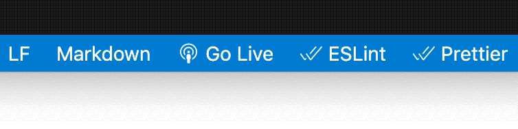

# 3D-Shared-Space

This is an example of a multiuser live 3D environment in [p5.js](https://p5js.org/) with [p5LiveMedia](https://github.com/vanevery/p5LiveMedia). 

Try it [here](https://editor.p5js.org/shawn/sketches/JWqgLRAzu)


## Getting Setup to Work

There are a couple ways you can begin editing this template for your project.  You can either work locally using a local server or on a web editor such as the p5 web editor or glitch.

#### Working Locally
* Download this project to your machine using your computer's terminal application:

    ```bash
    git clone https://github.com/vanevery/3D-Shared-Space.git
    ```

* Enter into the downloaded project folder:

    ```bash
    cd 3D-Shared-Space
    ```

* Start a local server 
    * from the terminal:

        ```bash
        # if you have http-server installed...
        http-server
        # or using python simple server...
        python3 -m http.server 8000 --bind 127.0.0.1 
        ```

    * Or, if you use VS Code, you could try the [Live Server](https://marketplace.visualstudio.com/items?itemName=ritwickdey.LiveServer) extension, which has the added benefit of automatically reloading your webpage when you change the code!

     


#### Using a Web Editor

* This template can also be duplicated and edited directly in web editors such as the [p5 Web Editor](https://editor.p5js.org/) or [Glitch](https://glitch.com/).

    * [p5 Web Editor Project]() – Duplicate to edit
    * [Glitch Project](https://glitch.com/edit/#!/3d-shared-space) – Remix to edit
